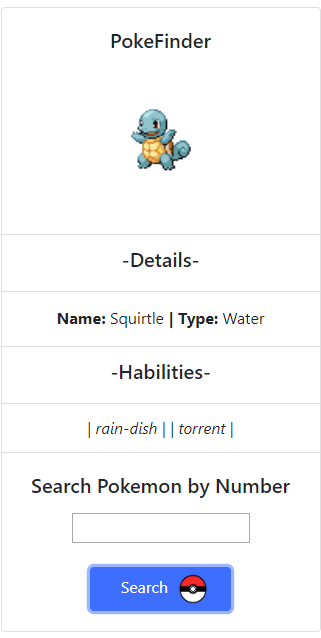

<h1 align="center">Learning Async/Await with PokeAPI</h1>
<p align="center"><i>The objective of this project is to train async / await through the search for pokemon in PokeAPI</i></p>

## Prerequisites

Required Libraries:
* Axios ➜  ```npm install axios```

## Design
<i>Bootstrap 4 only</i>




## Built With

* [Bootstrap](https://getbootstrap.com/) 
* [PokeAPI](https://pokeapi.co/)
* [Browserify](http://browserify.org/)
## Authors

* **Antonio Mello Babo**  - [Mello](https://github.com/MelloTonio)

