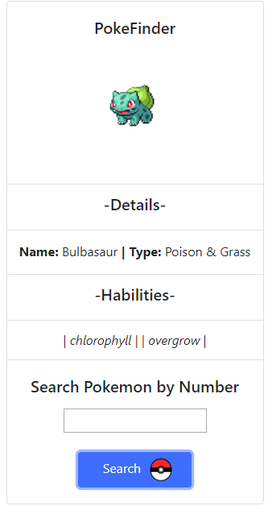

# Learning Async/Await with PokeAPI

Utilizando uma api para aprender sobre troca de informações no Js

### Prerequisites

Bibliotecas necessárias para rodar:
* Axios
* Feito com auxilio do Browsify

```npm init ```
 ```npm install axios```  

### Design

* Bootstrap Simples




## Built With

* [Bootstrap](https://getbootstrap.com/) 


## Authors

* **Antonio Mello Babo**  - [Mello](https://github.com/MelloTonio)

